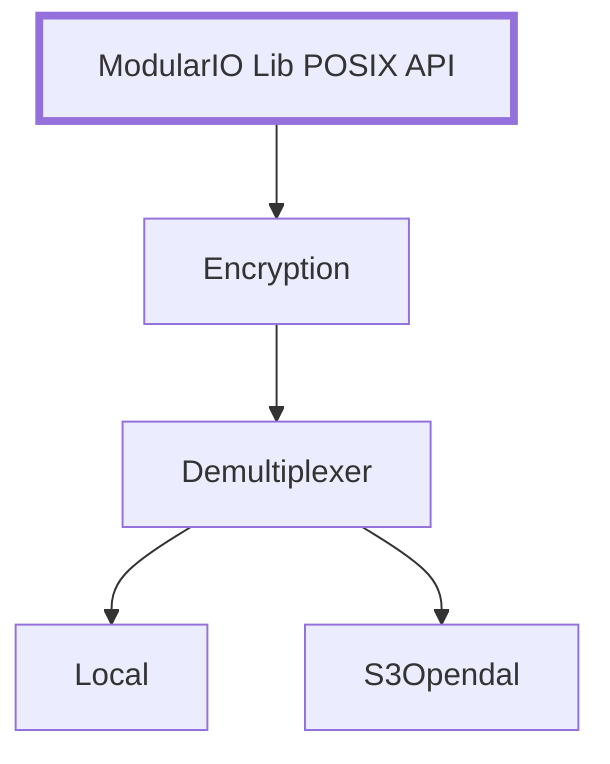

# TamperGuard Library

TamperGuard is a modular I/O library that adds anti-tampering detection to existing applications at the filesystem level. This prototype uses FUSE to intercept operations like open, close, read, write, and truncate, and adds anti-tampering guarantees by computing an hash of the file data and storing it in a separate storage backend. On every file access, the hash is computed again and compared to the stored hash. If the hashes do not match, a log message is written alerting the user to a possible tampering detection.

The storage backend can be specified in the configuration file. There are three given options: local storage, IPFS storage, and a Solana blockchain. The latter, is not yet tested in a real case scenario due to its performance limitations and is only briefly mentioned in the TamperGuard paper. The library that is reponsible for the storage services integration is invisible-storage(https://github.com/invisiblelab-dev/invisible-storage), which has bindings to C in invisible-storage-bindings(https://github.com/invisiblelab-dev/invisible-storage-bindings).

TamperGuard is part of a bigger Modular I/O project with additional layers and features that will be published soon. This repository focuses on a quick-start guide for running the TamperGuard prototype with the configurations used in the submitted paper, including the same testing scripts. The rest of the repository covers other features that are currently in progress.

## Quick Start Guide for TamperGuard
Make sure you have the following packages installed:
#### Ubuntu/Debian
```bash
sudo apt install make pkg-config libglib2.0-dev gcc libssl-dev g++ libcurl4-openssl-dev
```

In order to run TamperGuard prototype, you need to install libfuse and Rust.
### 1. Installing libfuse

#### Ubuntu/Debian
```bash
sudo apt install libfuse3-dev fuse3
```

### 2. Installing Rust
Use **rustup** (required for building invisible-storage-bindings; system packages like `apt install rustc cargo` are often too old and can fail on the submodule's `Cargo.lock`):
```bash
curl --proto '=https' --tlsv1.2 -sSf https://sh.rustup.rs | sh
export PATH="$HOME/.cargo/bin:$PATH"
```

### 3. Building TamperGuard prototype
```bash
git submodule update --init --recursive
make build BUILD_INVISIBLE=1
```

#### 3.1 Verify Rust installation:
```bash
rustc --version
cargo --version
```

### 4. Create your configuration:
#### 4.1. If you want to run FUSE passthrough:
```bash
cp config.toml.passthrough.example config.toml
```

#### 4.2. If you want to run TamperGuard with local hashes do:
```bash
mkdir /tmp/hashes
cp config.toml.local.example config.toml
```

#### 4.3. If you want to run TamperGuard with hashes on IPFS storage do:
```bash
cp config.toml.ipfs.example config.toml
```

Install and run IPFS kubo v0.39.0 (https://docs.ipfs.tech/install/command-line/#install-official-binary-distributions):
```bash
wget https://dist.ipfs.tech/kubo/v0.39.0/kubo_v0.39.0_linux-amd64.tar.gz
tar -xvzf kubo_v0.39.0_linux-amd64.tar.gz
cd kubo
sudo bash install.sh
```

Make sure it is installed:
```bash
ipfs --version
```

Run the ipfs daemon in another terminal:
```bash
ipfs daemon
```

### 5. Run TamperGuard prototype:
```bash
make examples/fuse/run
```

The default mount point is examples/fuse/mount_point. You can change it by running:
```bash
make examples/fuse/run MOUNT_POINT=/path/to/mount BACKEND_DATA=/path/to/backend_data
```
More info on examples can be found in examples/fuse/README.md.

### 6. Run tests:
#### 6.1. Run PostgreSQL pgbench workload:
Install PostgreSQL:
```bash
sudo apt install postgresql
```

Initialize the PostgreSQL data directory (binaries are typically located in /usr/bin, e.g. /usr/bin/initdb):
```bash
/usr/bin/initdb -D examples/fuse/mount_point/ --username=postgres
```

Start the PostgreSQL server:
```bash
/usr/bin/pg_ctl -D examples/fuse/mount_point/ start
```

If this step isn't working, remember to change the `unix_socket_directories` path to use `/tmp`, and create the folder with:
```bash
mkdir -p /tmp/postgresql && chmod 1777 /tmp/postgresql
```

Run the PostgreSQL pgbench mix read/write workload:
```bash
./scripts/postgresql/pgbench_workload.sh --data-dir examples/fuse/mount_point --postgres-bin /usr/bin --db-user postgres --db-name mydb --duration 900 --repeats 5 --read-only 0
```

Run the PostgreSQL pgbench read-only workload:
```bash
./scripts/postgresql/pgbench_workload.sh --data-dir examples/fuse/mount_point --postgres-bin /usr/bin --db-user postgres --db-name mydb --duration 900 --repeats 5 --read-only 1
```

Run the PostgreSQL pgbench write-only workload:
```bash
./scripts/postgresql/pgbench_workload.sh --data-dir examples/fuse/mount_point --postgres-bin /usr/bin --db-user postgres --db-name mydb --duration 900 --repeats 5 --write-only 1
```
#### 6.1. Run filebench workload:
Install filebench:
```bash
git clone git@github.com:filebench/filebench.git
```
Follow the instructions in filebench/README.md (https://github.com/filebench/filebench#) to build and install filebench.

If having problems on running filebench, try using the branch containing the fix in the following PR: https://github.com/filebench/filebench/pull/169 (the fix is not yet merged, so you need to use the branch manually).

Set the $dir to the mount point for each workload (scripts/filebench/workloads/webserver.f, scripts/filebench/workloads/fileserver.f, scripts/filebench/workloads/varmail.f).

Run the filebench workload:
```bash
./scripts/filebench/filebench_repeats.sh --workload scripts/filebench/workloads/webserver.f --workload scripts/filebench/workloads/fileserver.f --workload scripts/filebench/workloads/varmail.f --repeats 5 --interval 10
```

Full example test results can be found in scripts/filebench/tamper_guard_results/README.md.
More info on the script can be found in scripts/filebench/README.md.

## Project Structure

```
├── 📁 layers/              # Pluggable I/O layers
├── 📁 examples/            # Example applications  
├── 📁 shared/              # Common utilities and types
├── 📁 scripts/             # Scripts to test and benchmark
├── 📁 tests/               # Unit and integration tests
├── 📁 config/              # Configuration system
├── 📁 lib/                 # External dependencies (submodules)
└── 📄 config.toml.example  # Example configuration file
```

## Content

### Core Components

- **[Configuration System](config/README.md)** - TOML-based layer configuration
- **[Shared Components](shared/README.md)** - Types, utilities, and hasher algorithms

### Storage Layers

- **[Local Layer](layers/local/README.md)** - Local filesystem storage
- **[Remote Layer](layers/remote/README.md)** - Network-based remote storage
- **[Anti-Tampering Layer](layers/anti_tampering/README.md)** - Data integrity with SHA-256/SHA-512
- **[Compression Layer](layers/compression/README.md)** - LZ4/ZSTD compression support
- **[Encryption Layer](layers/encryption/README.md)** - Data Encryption with AES-256-XTS
- **[Block Align Layer](layers/block_align/README.md)** - Block-aligned I/O operations
- **[Demultiplexer Layer](layers/demultiplexer/README.md)** - Parallel multi-backend operations
- **[Read Cache Layer](layers/cache/read_cache/README.md)** - Read caching using CacheLib
- **[Invisible Storage Layer](layers/invisible_storage/README.md)** - Invisible storage integration

### Examples

- **[FUSE Example](examples/fuse/README.md)** - FUSE filesystem implementation
- **[Invisible Example](examples/invisible/README.md)** - Invisible Storage SDK example demonstration
- **[Storage Server Example](examples/storserver/README.md)** - Network storage server

### Testing

- **[Tests](tests/README.md)** - Unit tests, integration tests, and testing infrastructure

## Architecture

ModularIOLib exports a POSIX-compatible API. The library parses a user-provided layer configuration and dynamically stacks the various layers on top of each other. Each layer implements the same POSIX-compatible API, is fully independent, and remains agnostic of the layers above or below it.

The bottom layer must be a persistence layer that handles actual data storage (e.g., local, s3_opendal, etc.).

Here is an example of a possible configuration:

## Quick Start

### Install

Make sure you have the following packages installed:
#### Ubuntu/Debian
```bash
sudo apt install make pkg-config libglib2.0-dev gcc libssl-dev g++ libcurl4-openssl-dev
```

### Installing libfuse
In order to run the most complete example, you need to install libfuse.

#### Ubuntu/Debian
```bash
sudo apt install libfuse3-dev fuse3
```

For more detailed installation instructions, see the [libfuse documentation](https://github.com/libfuse/libfuse).

**Note**: This project is only tested on Linux systems and is not guaranteed to work on macOS or other operating systems.

### Install rust
In order to use invisible-storage, you need to install rust (v1.88.0) and cargo (v1.88.0):
#### Ubuntu/Debian
```bash
curl --proto '=https' --tlsv1.2 -sSf https://sh.rustup.rs | sh
sudo apt install rustc cargo
```

## Build Everything

```bash
# Initialize submodules and build all components
git submodule update --init --recursive

make build BUILD_INVISIBLE=1 BUILD_CACHELIB=1
# or to build without invisible storage (S3 and Solana support)
# make build
```

### Configuration

Copy and customize the example configuration:

```bash
cp config.toml.example config.toml
# Edit config.toml to define your layer architecture (see Configuration Example below)
```

#### Simple Configuration
The simplest configuration, which behaves as a passthrough, would look like this:
```toml
root = "local_layer"
log_mode = "debug"

[local_layer]
type = "local"
```

#### Encryption Configuration Example
A simple configuration which performs encryption and stores locally (more about it [here](layers/encryption/README.md)):
```toml
root = "block_align"
log_mode = "debug"

[block_align]
type = "block_align"
block_size = 262144 // 256kb
next = "encryption_layer"

[encryption_layer]
type = "encryption"
block_size = 262144 // 256kb
encryption_key = "1234567890123456789012345678901234567890234567890123456789012345"
next = "local_layer"

[local_layer]
type = "local"
```

#### Anti-Tampering Configuration Example

The following shows a complete example config file demonstrating a multi-layer architecture with anti-tampering, demultiplexer, and blockchain (solana)/s3 to store hashes:

```toml
root = "anti_tampering_layer"
log_mode = "debug" # options (case insensitive): disabled, screen, error, warn, info, debug #

[anti_tampering_layer]
type = "anti_tampering"
hashes_storage = "/home/user/Modular-IO-Lib/examples/fuse/hashes" # Note: Use your absolute path here #
hash_layer = "demultiplexer_layer"
data_layer = "local_layer"
algorithm = "sha256" # options (case insensitive): sha256, sha512 - defaults to sha256 if not specified #

[demultiplexer_layer]
type = "demultiplexer"
layers = ["s3_layer", "solana_layer"]

[demultiplexer_layer.options]
enforced_layers = ["s3_layer"]
passthrough_writes = ["solana_layer"]

[local_layer]
type = "local"

[s3_layer]
type = "s3_opendal"
endpoint = "some_endpoint"
access_key_id = "some_key_id"
secret_access_key = "some_secret_key"
bucket = "some_bucket"
region = "some_region"
root = "some_root"

[solana_layer]
type = "solana"
keypair_path= "some_keypair_path"
rpc_url = "some_rpc_url"
```

This example configuration demonstrates:

- **Root Layer**: `anti_tampering_layer` as the entry point
- **Security Layer**: Anti-tampering with SHA-256 hashing and separate hash/data storage
- **Routing Layer**: Demultiplexer managing multiple storage backends with different policies
- **Storage Backends**: Local filesystem, S3-compatible storage, and Solana blockchain storage
- **Layer Relationships**: How layers reference and chain to each other

**Key Configuration Concepts:**

- Each layer has a unique name (e.g., `local_layer`, `solana_layer`) used for referencing
- The `root` parameter defines the entry point layer
- Layers can reference other layers to create processing chains
- The `demultiplexer` layer enables parallel operations across multiple backends
- Each layer type has specific configuration parameters (see individual layer documentation)

For detailed configuration options for each layer type, see the [layer documentation](#storage-layers).

## Run an Example

After learning how to create a config, it's time run one example.

**The FUSE example is the one that supports the most features in this repo. It's the one you should build to better test our layers and features.**
For more info on how to run the other examples, please visit its dedicated info pages.

```bash
# Build and run the FUSE example
make examples/fuse/build
make examples/fuse/run
```

## Available Commands

```bash
make help                    # Show all available targets
```
## Contribute: Adding a New Layer

To add a new layer to the library:

1. **Create layer files**: `layers/your_layer/your_layer.c`, `your_layer.h`, `config.h`
2. **Add to enum**: Add `LAYER_YOUR_LAYER` to `shared/enums/layer_type.h`
3. **Update config system**: Add your layer to `config/declarations.h`, `parser.c`, and `builder.c`
4. **Implement functions**: Create `your_layer_init()` and implement all POSIX operations
5. **Add to Makefile**: Include your layer in the build system

See existing layers like `compression` or `local` for reference implementations.
## Documentation System

This project uses **MkDocs** with **Material theme** for generating searchable documentation from README files.

## Docs
### Documentation Commands

```bash
make docs/serve     # Start development server with live reload
make docs/build     # Generate static HTML documentation  
make docs/clean     # Clean generated documentation files
make docs/links     # Manually create/update symbolic links
```

### How It Works

- **Automatic Discovery**: The system automatically finds all `.md` files in the repository
- **Dynamic Linking**: Creates symbolic links in `docs/mkdocs/` pointing to actual markdown files
- **Preserves Structure**: Original markdown files stay in their natural locations for GitHub navigation
- **Clean Separation**: Generated files go to `docs/mkdocs_static/`, original docs resources remain untouched
- **Auto-Updates**: GitHub Action automatically rebuilds documentation when any `.md` file changes

### **Markdown File Discovery**

**Any `.md` file** in the repository will be automatically included in the documentation.

**Included Files**: All `.md` files except those in excluded directories (`build/`, `lib/`, etc.) or common non-documentation files (`CHANGELOG.md`, `CONTRIBUTING.md`, `LICENSE.md`).

**Structure Preservation**: The exact original file structure and names are preserved:

- `layers/local/README.md` → `layers/local/README.md`
- `config/INSTALL.md` → `config/INSTALL.md`
- Root `README.md` → `index.md` (MkDocs homepage convention)

**Link Compatibility**: Use full paths (e.g., `layers/local/README.md`) for links that work in both GitHub and MkDocs.

### Generated Structure

```
docs/
├── mkdocs/           # Source links (auto-generated, don't edit)
├── mkdocs_static/    # Static HTML output (for deployment)
├── *.pdf *.png       # Original documentation resources (preserved)
└── ...
```

### Viewing Documentation

- **Development**: Run `make docs/serve` and visit http://localhost:8000
- **Static**: Open `docs/mkdocs_static/index.html` in your browser
- **GitHub**: Navigate README files naturally in their directories

## License

This project is licensed under the MIT License. See `LICENSE`.

---

**Need help?** Check the documentation links above or run `make help` for available commands.
